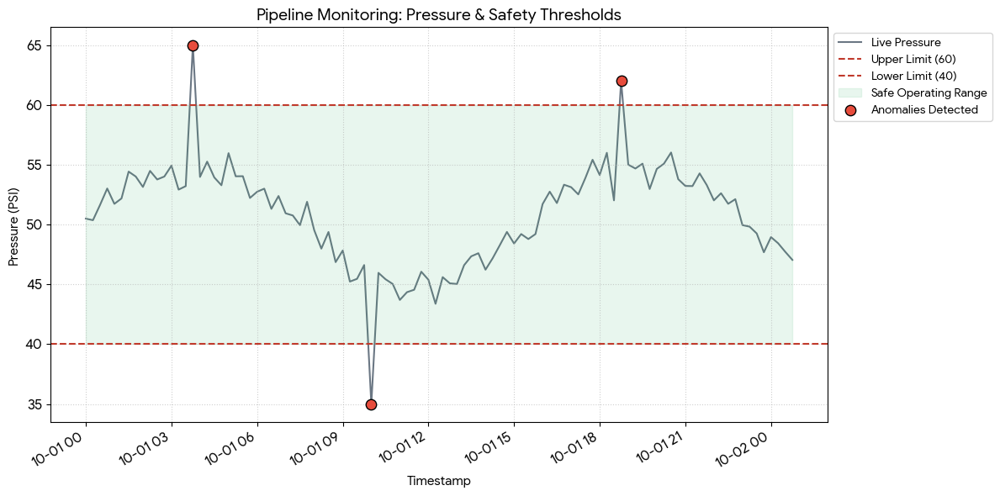

#Pipeline Integrity Monitoring & Leak Detection System

## Overview

This project simulates an industrial pipeline monitoring system designed to detect leaks and anomalies using a combination of:

- Engineering safety thresholds  
- Statistical anomaly detection (Z-score)  
- Machine Learning-based anomaly detection (Isolation Forest)  
- Real-time visualization dashboard  

It reflects how modern oil & gas monitoring systems combine physics-based rules with AI-driven insights.

## Problem Statement

Pipeline systems in the oil & gas industry are vulnerable to:

- Undetected leaks  
- Pressure drops  
- Gradual structural degradation  
- Delayed human response to anomalies  

This project simulates a monitoring system that detects such issues early using data-driven techniques.

## System Architecture

The system operates in three layers:

### 1. Engineering Safety Layer
- Fixed pressure thresholds (safe operating zone: 40–60 PSI)
- Immediate alert when values go outside safe range

### 2. Statistical Layer
- Z-score anomaly detection
- Detects deviations from normal behavior

### 3. AI Layer
- Isolation Forest algorithm
- Learns normal patterns and detects anomalies automatically


## Features

- Synthetic pipeline data generation
- Leak simulation (sudden pressure drops)
- Gradual corrosion modeling
- Multi-layer anomaly detection
- Interactive visualization with safety zones
- Clean modular Python architecture


## How It Works

1. Pipeline pressure data is simulated
2. Data is analyzed using:
   - Threshold rules
   - Statistical deviation
   - Machine learning model
3. Detected anomalies are highlighted on a graph
4. Safe operating zone is visualized


## Visualization

The system visualizes:

- Live pressure trend
- Safe operating range (40–60 PSI)
- Detected anomalies highlighted in red

Example plot:




## 🛠️ Tech Stack

- Python
- NumPy
- Pandas
- Matplotlib
- Scikit-learn

## 🚀 How to Run

### 1. Install dependencies

```
pip install -r requirements.txt
```

### 2. Run the system

```bash id="rm4"
python main.py
```


## Requirements

```
numpy
pandas
matplotlib
scikit-learn
```


## Key Insights

* Engineering thresholds provide immediate safety control
* Statistical methods detect unusual deviations
* AI models improve adaptability to complex patterns
* Combining all three creates a robust monitoring system
  

##  Future Improvements

* Real-time streaming simulation (IoT-style data flow)
* Streamlit dashboard interface
* Multi-sensor integration (flow, temperature, vibration)
* Predictive maintenance modeling
* Deployment as a web monitoring system


## Learning Outcome

This project demonstrates:

* Industrial data simulation
* Anomaly detection techniques
* Hybrid AI + rule-based systems
* Data visualization for monitoring systems
* Modular Python system design


## 👤 Author

Built as a data science + energy systems simulation project focused on oil & gas pipeline integrity monitoring.
by: Muhammad Ibrahim Gimba

## 📌 Note

This is a simulation-based system and does not use real industrial pipeline data.
It is designed for educational and portfolio demonstration purposes.
